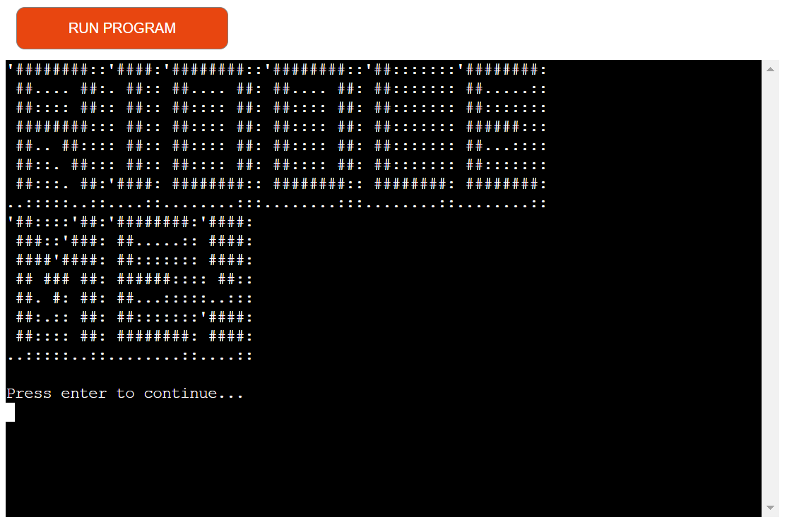

# Riddle Me!

This is a small game/quiz that allows you to gain an ability in a magical cave. However, in order to obtain the ability, you must correctly answer a series of riddles. \

[Live Link](https://riddle-my-ability-61bcefb6fcc4.herokuapp.com/)

---

## How To Play?

- Firstly, you will be prompted to enter your name.
- Secondly, you will be asked to enter the ability you wish to acquire.
- Third, you will be presented with a riddle along with four answer choices: a, b, c, and d. You can also choose to exit the game by entering "x"
- Keep in mind that you have only one attempt to answer each riddle. If you fail to answer correctly, the game will exit. Remember, this gift is not easily obtained!
- To gain the ability, you need to answer five riddles correctly.

---

## Design and UX

### Color

- I used Colorama to make the terminal colorful.
- When choosing colors i wanted to ensure there is sufficient separation to make it much easier to read.
- Green, Red, Blue, Cyan and White. Very simple and mild colors that present what they need just by the color themselves.

### Art

- As for ASCII, I wanted to add some extra life, so I included ASCII art since it's a fun way to enhance the terminal experience.

### User Experience

- The user interface is designed to be straightforward, following a linear path that leaves little room for confusion, except when it comes to the riddles.

---

## Flowchart!

- I created a flowchart to understand the game's progression and assist me in figuring out the mechanics.

---

## Features

### HTML / CSS

---

### Terminal

#### Welcome Screen.

    - This screen is what welcomes the user to the game.
    - Ascii art with the name of the game
    - Then a simple way forward. "Press enter to continue..."

---

#### Game Instruction and Welcome

    - The game begins with a welcoming text that outlines what you can expect from the game.
    - It provides you with the motivation behind playing the game,
      highlighting the reasons why you should press enter again.
    - Following that, there is a concise and straightforward explanation of the rules,
      keeping them minimal and easy to understand.

---

#### Name

    - Now it is asking for your name it gives you clear information on what you can and cant do.

---

#### Ability

    - It then asks for the ability that you wish to learn!

---

#### Riddle

    - After you have put in your name and ability you will be greeted with your
      name and your ability will be mentioned.
    - Once again you will be reminded that you need to pass the test of riddles to be worthy!
    - The Riddle will be presented with four choices to chose from
    - The alternatives will be a, b, c and d
    - You can always give up and exit the game by entering x!

---

#### Right Answer

    - When you get the right answer you will be handed a green correct answer
      message and the next riddle will be presented to you.

---

#### Wrong Answer

    - When you answer wrong you will be thrown out of the game since you have one chance to make it!

---

#### All correct

    - When you finish all the five riddles you will be presented with your ability in beautiful ascii art!

---

#### Error handling

    - Empty name / ability
    - Only numbers on both name and ability
    - Answer choice not available

 \
 \

---

## Data Model

By structuring the riddles as dictionaries within a list, i have created an easily manageable data model. This approach allows for convenient addition, removal, and modification of the riddles being asked. The chosen data structure offers flexibility, making it effortless to add as many riddles as desired at any time.

- riddle - Stores the riddle.
- choices - Stores the available choices connected to the riddle.
- correct_answer - Stores the correct answer connected to the riddle, allowing for easy comparison to determine if your choice is correct.

---

## Testing

### PEP8

All python code was ran through [PEP8 CI](https://pep8ci.herokuapp.com/) validator and any warnings or errors were fixed. \
Code then validated successfully.

### Functional testing

| Description                                  | Steps                                            | Expected                                                                                | Actual                                                                                  | RESULT                                |
| -------------------------------------------- | ------------------------------------------------ | --------------------------------------------------------------------------------------- | --------------------------------------------------------------------------------------- | ------------------------------------- |
| Program start ascii logo                     | Run the program.                                 | Ascii art displayed, enter to continue...                                               | Ascii art displayed, enter to continue...                                               | PASS |
| What happens if i Press enter to continue... | Press enter to see what happens                  | I get presented with a welcome message with simple rules and press enter to continue... | I get presented with a welcome message with simple rules and press enter to continue... | PASS |
| Does the press enter work?                   | I press enter to continue... to see if it works. | It takes me to the part where i have to enter my name.                                  | It takes me to the part where i have to enter my name.                                  | PASS |
|Writing my name | I write in my name Birger and press enter. | It greets me with my name and asks to know what ability i want. | It greets me with my name and asks to know what ability i want. |  PASS |
| Writing in ability | I write in the ability to Fly and press enter. | It greets me with my name and ability, tells me some info and gives me the first riddle. |  It greets me with my name and ability, tells me some info and gives me the first riddle. | PASS |
| Answer the riddle. | I choose one of the options that i know is correct and press enter. | It tells me Correct answer and gives me the next riddle | It tells me Correct answer and gives me the next riddle | PASS |
| Answer riddle wrong. | I choose one of the options that i know is wrong and press enter | I reach a Game Over name screen, that tells me to enter y to try again or n to exit. | I reach a Game Over name screen, that tells me to enter y to try again or n to exit. | PASS |
| On Game Over choice try agin. | I choose the option to try again and enter 'y' | It restarts the riddle from question one again. |  It restarts the riddle from question one again. | PASS |
| On Game Over choice exit | I make a choice to exit the game and enter 'n' to exit | Game exits and gives a exit message. | Game exits and gives a exit message. | PASS |
| Answer all riddles right. | I try each riddle to make sure the right answer is the correct answer | All riddles have the correct answer. | All riddles have the correct answer. | PASS |
| Win the game. | I answer all riddles correct | I get to the victory screen, where you are greeted with your name and the ability written with ASCII art. |  I get to the victory screen, where you are greeted with your name and the ability written with ASCII art. | PASS |
| Enter only numeric name / ability | I write in an only numeric name / ability | I get an error message telling me the name cannot be purely numeric. | I get an error message telling me the name cannot be purely numeric. | PASS |
| Enter an empty/only blankstep name / ability |  I make two blanksteps in the name / ability input and hit enter. | It returns an error message that tells me the name / ability cannot be empty, this is because i use .strip() so the blanksteps is removed, therefore it is empty. | It returns an error message that tells me the name / ability cannot be empty, this is because i use .strip() so the blanksteps is removed, therefore it is empty. | PASS |
| A non existant answer to a riddle | I enter v as the answer | I get an error message telling me to chose a valid option. a,b,c or d | I get an error message telling me to chose a valid option. a,b,c or d | PASS |
| Exit from the answer input | I try and enter 'x' to exit from the answer input | Game exits and gives a exit message. | Game exits and gives a exit message. |  PASS |
|

### Bugs and Fixes

- Problem: When i insert a capitalized letter as answer it gives wrong answer even if its the right one!
  - Solution: add .lower() to make sure the input is lowercased before it is verified.
- Problem: Its possible to bypass my checks by inserting blankspaces...
  - Solution: Add .strip() behind the input to remove the blankspaces and it will be empty for the verification.
- Problem: Answering question with the right answer but followed by a blankstep = error...
  - Solution: solved with .strip() after the answer input.
- Problem: When i add the "os.system('cls' if os.name == 'nt' else 'clear')" that i use to clear the terminal before name and ability it makes the verification on the name and ability input stop working!
  - Solution: I put it in a different place to make sure the verification checks is working properly.

---

## Tools and Technology Used

- HTML
  - The main structure of the site was developed using HTML.
- CSS
  - The website was styled using CSS with an external file.
- Python
  - The logic was created using Python.
  - Packages used:
    - OS - Used to clear the screen depending on the OS used, cls or clear.
    - Pyfiglet - Used to easy add Ascii art creation on words.
    - Colorama - Used for a simple way to put color usage into the terminal.
- Visual Studio Code
  - The website was developed with Visual Studio Code as the IDE.
- GitHub
  - Source code is hosted on GitHub and deployed using Git Pages.
- GitKraken
  - https://www.gitkraken.com/ was used to commit and push code during development.
- Lucidchart
  - Lucidchart was used to create the flowchart.
- Pythontutor
  - Was used to help me understand the flow of things when it was breaking.

---

## Deployment

### Version Control

The project was created using Visual Studio Code and pushed to GitHub to the remote repository riddleme.

I have developed this project using two different Windows computers: one laptop and one stationary desktop. I have kept the code up to date throughout my work by a tool called GitKraken, which provides an outstanding overview of my workflow. Its graphical user interface allows me to track my commits throughout the entire project and clearly indicates which system i used for each commit. This fortunate knowledge helps me locate the original files easily if i need to rework something.

During this process i have also had the choice to use the terminal in GitKraken to use commands such as git pull, git add, git commit and git push. However i rarely been using this.

### Heroku

The below steps were followed to deploy this project to Heroku:

- Go to Heroku and click "New" to create a new app.
- Choose an app name and region, click "Create app".
- Go to "Settings" and navigate to Config Vars. Add the following config variables:
  PORT : 8000
- Navigate to Buildpacks and add buildpacks for Python and NodeJS (in that order).
- Navigate to "Deploy". Set the deployment method to Github and enter repository name and connect.
- Scroll down to Manual Deploy, select "main" branch and click "Deploy Branch".
- The app will now be deployed to heroku \
  [Heroku Live Link](https://riddle-my-ability-61bcefb6fcc4.herokuapp.com/)

---

## Inspiration, tutorials and content from:

- https://realpython.com/python-quiz-application/ - Much inspiration gathered from this source.
- https://medium.com/@rahulmallah785671/creating-an-engaging-quiz-game-with-python-a-step-by-step-guide-ea11bd76f159 - the idea of list with dictionary comes from here.
- https://www.geeksforgeeks.org/print-colors-python-terminal/ - For the use of colorama and colors is from here and my mentor.
- https://www.geeksforgeeks.org/python-ascii-art-using-pyfiglet-module/ - the pyfiglet ascii module is from here and my mentor.
- https://www.geeksforgeeks.org/clear-screen-python/ - the clear screen is straight from here and my mentor.
- https://play.howstuffworks.com/quiz/test-your-mental-mettle-with-these-ridiculous-riddles - most riddles and answers is from here.

---

## Credits

My mentor Gareth McGill \
https://www.stackoverflow.com/ - all the amazing contributors making life easy for everyone else!
