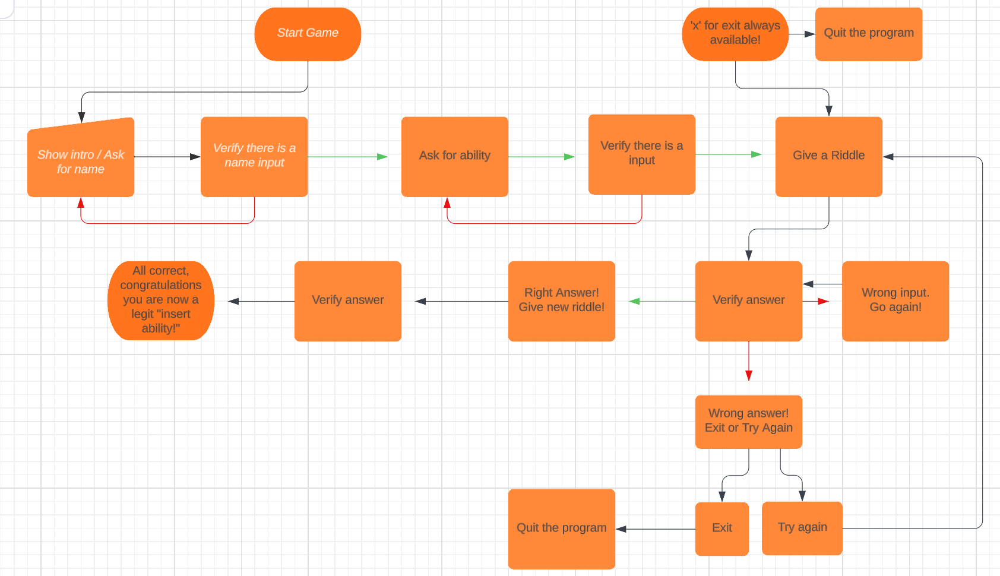

Flowchart! \

Overall inspiration and ideas from:
 - https://realpython.com/python-quiz-application/
 - https://medium.com/@rahulmallah785671/creating-an-engaging-quiz-game-with-python-a-step-by-step-guide-ea11bd76f159
 - https://www.geeksforgeeks.org/print-colors-python-terminal/
 - https://www.geeksforgeeks.org/python-ascii-art-using-pyfiglet-module/
 - https://www.geeksforgeeks.org/clear-screen-python/

 Buggs
  - when i insert a capitalized letter it goes false!
   - Solution: add .lower() to make sure the input is lowercased
  - Its possible to bypass my checks by inserting blankspaces...
    - Add .strip() behind the input to remove the blankspaces and it will be empty

ToDo:
    Error Handling
    Color

