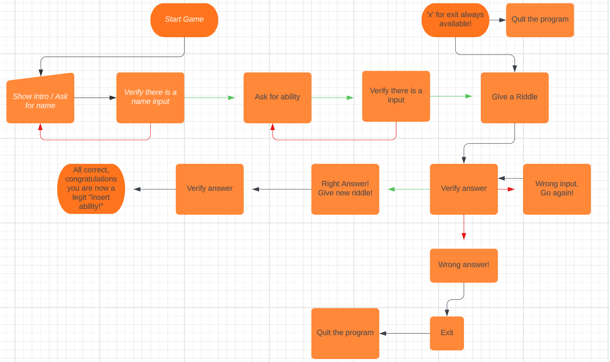
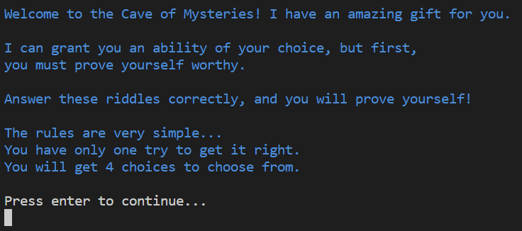

# Riddle Me!
This is a small game/quiz that allows you to gain an ability in a magical cave. However, in order to obtain the ability, you must correctly answer a series of riddles.

---

## How To Play?
- Firstly, you will be prompted to enter your name.
- Secondly, you will be asked to enter the ability you wish to acquire.
- Third, you will be presented with a riddle along with four answer choices: a, b, c, and d. You can also choose to exit the game by entering "x"
- Keep in mind that you have only one attempt to answer each riddle. If you fail to answer correctly, the game will exit. Remember, this gift is not easily obtained!
- To gain the ability, you need to answer five riddles correctly.
---
## Design and UX
### Color 
- When choosing colors i wanted to ensure there is sufficient separation to make it much easier to read.
- Green, Red, Blue, Cyan and White. Very simple and mild colors that present what they need just by the color themselves.

### Art
- As for ASCII, I wanted to add some extra flexibility, so I included ASCII art since it's a fun way to enhance the terminal experience.

### User Experience
- The user interface is designed to be straightforward, following a linear path that leaves little room for confusion, except when it comes to the riddles.
---
## Flowchart! 
- I created a flowchart to understand the game's progression and assist me in figuring out the mechanics.

---

## Features
### HTML / CSS

---

### Terminal

#### Welcome Screen.
    - This screen is what welcomes the user to the game.
    - Ascii art with the name of the game 
    - Then a simple way forward. "Press enter to continue..."

---

 #### Game Instruction and Welcome
    - The game begins with a welcoming text that outlines what you can expect from the game.
    - It provides you with the motivation behind playing the game, highlighting the reasons why you should press enter again.
    - Following that, there is a concise and straightforward explanation of the rules, keeping them minimal and easy to understand.

 

---

#### Name 
    - Now it is asking for your name it gives you clear information on what you can and cant do.

---

#### Ability
    - It then asks for the ability that you wish to learn!

  

---

#### Riddle
    - After you have put in your name and ability you will be greeted with your name and your ability will be mentioned.
    - Once again you will be reminded that you need to pass the test of riddles to be worthy!
    - The Riddle will be presented with four choices to chose from
    - The alternatives will be a, b, c and d
    - You can always give up and exit the game by entering x!

---

#### Right Answer
    - When you get the right answer you will be handed a green correct answer message and the next riddle will be presented to you.

---

#### Wrong Answer
    - When you answer wrong you will be thrown out of the game since you have one chance to make it!

---

#### All correct
    - When you finish all the five riddles you will be presented with your ability in beautiful ascii art!

---

#### Error handling
    - Empty name / ability
    - Only numbers on both name and ability
    - Answer choice not available
 \
 \

---

## Testing 

## Tools and Technology Used
- HTML
  - The main structure of the site was developed using HTML.
- CSS
  - The website was styled using CSS with an external file.
- Python
  - The logic was created using Python.
  - Packages used:
    - OS
    - Pyfiglet
    - Colorama
- Visual Studio Code
  - The website was developed with Visual Studio Code as the IDE.
- GitHub
  - Source code is hosted on GitHub and deployed using Git Pages.
- GitKraken
  - https://www.gitkraken.com/ was used to commit and push code during development.
- Lucidchart
  - Lucidchart was used to create the flowchart.
- Pythontutor
  - Was used to help me understand the flow of things when it was breaking.

## Overall inspiration, ideas and content from:
 - https://realpython.com/python-quiz-application/
 - https://medium.com/@rahulmallah785671/creating-an-engaging-quiz-game-with-python-a-step-by-step-guide-ea11bd76f159
 - https://www.geeksforgeeks.org/print-colors-python-terminal/
 - https://www.geeksforgeeks.org/python-ascii-art-using-pyfiglet-module/
 - https://www.geeksforgeeks.org/clear-screen-python/
 - https://play.howstuffworks.com/quiz/test-your-mental-mettle-with-these-ridiculous-riddles
 - https://www.stackoverflow.com/

 ## Buggs
  - when i insert a capitalized letter it goes false!
    - Solution: add .lower() to make sure the input is lowercased
  - Its possible to bypass my checks by inserting blankspaces...
    - Add .strip() behind the input to remove the blankspaces and it will be empty
  - Answering question with the right answer but followed by a blankstep = error...
    - solved with .strip()
  - When i add os.system('cls' if os.name == 'nt' else 'clear') to clear before name and ability it makes the 
    verification on the name and ability input stop working!
    - solved with removing it and putting it in another place.

